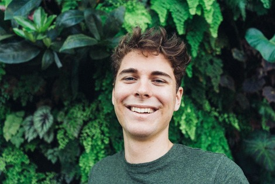

# Pixelate Me: telegram bot to make beautiful pixelated profile pictures


## Run
__Use Google Colab to run__

IMPORTANT: set your Telegram API token to `TOKEN` variable

[](https://colab.research.google.com/github/olegkhomenko/pixelate-me-tg/blob/master/pixelate_me_tg.ipynb)


### Algorithm's result example
__Original image__



__Result__


## Tunable options
You can configure parameters in function `pixelate`.
```python
def pixelate(image: Union[str, np.ndarray],
             colors=10, factor=8, dither=False, quantize_by_factor=4,
             segmentation_network=None) -> dict
```
Just modify the line:
```python
res = pixelate(img, segmentation_network=segm_net)
```

## Future work
- move from `bot.polling()` to _webhooks_
- add heuristics for better pixel images
- replace face detection algorithm w/ instance segmentation <br />
(face detection only works if your subject is facing forward)
- replace white background w/ `bg_color` hyperparameter
